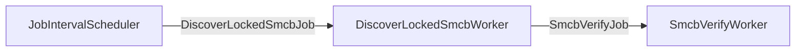
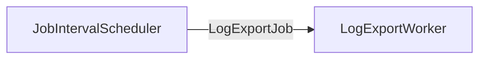

# smcb-unlocker

This is a companion application for a Secunet TI Konnektor that can automate the following tasks:
- Automatic PIN verification for SMC-B cards
- Streaming of Konnektor logs to the application stdout
- Reporting of Konnektor errors to Sentry
- Rebooting on a schedule

The application works with hardware (Einboxkonnektor, Rechenzentrumskonnektor) and software (Highspeedkonnektor) Secunet Konnektors.

## Configuration

The application makes use of [pydantic-settings](https://docs.pydantic.dev/latest/concepts/pydantic_settings/) for its configuration.
The primary method of configuration is a file with the name `config.yaml` in the working directory of the process.
An example configuration is given in `config.example.yaml`.

A minimal configuration could look like this:
```yaml
konnektors:
  my_konnektor:
    base_url: https://my.konnektor.priv:8500
    interval: 300

credentials:
  konnektors:
    my_konnektor:
      username: super
      password: konnektor

  kt:
    "00:1B:2C:3D:4E:5F":
      username: admin
      password: "87654321"
  smcb:
    "01234567890123456789":
        pin: "87654321"
```

This configures the application to check the Konnektor with URL `https://my.konnektor.priv:8500` every 5 minutes for locked SMC-B cards.
It will use the credentials `super:konnektor` for the Konnektor, `admin:87654321` for the card terminal with MAC address `00:1B:2C:3D:4E:5F` and the PIN `87654321` for the SMC-B with ICCSN `01234567890123456789`.

The application also supports the use of default fallback credentials for Konnektors, card terminals and SMC-Bs: If the key `_default` is given instead of a Konnektor name, card terminal MAC or SMC-B ICCSN, the given credentials will be used as a fallback.

## Structured Logging

The deployments of `smcb-unlocker` in Google Cloud make use of structured JSON logs in Google Cloud Logging.
While this makes the log output easily filterable, the default log view in Google Cloud may be very uninformative and look similar to this:

```
INFO 2025-11-17T19:18:25.936254552Z [smcb-unlocker] Start job
INFO 2025-11-17T19:18:26.575166799Z [smcb-unlocker] End job
```

The recommended way to view combined logs of the application in Google Cloud Logging is to configure the following fields in **Preferences > Manage summary fields**:
- `jsonPayload.job.konnektorName`
- `jsonPayload.job.type`
- `jsonPayload.job.jobId`

Quick links to view logs with this configuration:
- [Combined](https://console.cloud.google.com/logs/query;duration=PT1H;query=resource.type%3D%22k8s_container%22%0Alabels.%22k8s-pod%2Fapp_kubernetes_io%2Fname%22%3D%22smcb-unlocker%22%0A;summaryFields=jsonPayload%252Fjob%252Fkonnektor_name,jsonPayload%252Fjob%252Ftype,jsonPayload%252Fjob%252Fjob_id:false:32:beginning?project=prod-sha-prj-shared-1)
- [DiscoverLockedSmcbJob](https://console.cloud.google.com/logs/query;duration=PT1H;query=resource.type%3D%22k8s_container%22%0Alabels.%22k8s-pod%2Fapp_kubernetes_io%2Fname%22%3D%22smcb-unlocker%22%0AjsonPayload.job.type%3D%22DiscoverLockedSmcbJob%22;summaryFields=jsonPayload%252Fjob%252Fkonnektor_name,jsonPayload%252Fjob%252Ftype,jsonPayload%252Fjob%252Fjob_id:false:32:beginning?project=prod-sha-prj-shared-1)
- [VerifySmcbJob](https://console.cloud.google.com/logs/query;duration=PT1H;query=resource.type%3D%22k8s_container%22%0Alabels.%22k8s-pod%2Fapp_kubernetes_io%2Fname%22%3D%22smcb-unlocker%22%0AjsonPayload.job.type%3D%22SmcbVerifyJob%22;summaryFields=jsonPayload%252Fjob%252Fkonnektor_name,jsonPayload%252Fjob%252Ftype,jsonPayload%252Fjob%252Fjob_id:false:32:beginning?project=prod-sha-prj-shared-1)
- [RebootJob](https://console.cloud.google.com/logs/query;duration=PT1H;query=resource.type%3D%22k8s_container%22%0Alabels.%22k8s-pod%2Fapp_kubernetes_io%2Fname%22%3D%22smcb-unlocker%22%0AjsonPayload.job.type%3D%22RebootJob%22;summaryFields=jsonPayload%252Fjob%252Fkonnektor_name,jsonPayload%252Fjob%252Ftype,jsonPayload%252Fjob%252Fjob_id:false:32:beginning?project=prod-sha-prj-shared-1)
- [LogExportJob](https://console.cloud.google.com/logs/query;duration=PT1H;query=resource.type%3D%22k8s_container%22%0Alabels.%22k8s-pod%2Fapp_kubernetes_io%2Fname%22%3D%22smcb-unlocker%22%0AjsonPayload.job.type%3D%22LogExportJob%22%0AjsonPayload.protocol.type%3D%22OP%22;summaryFields=jsonPayload%252Fjob%252Fkonnektor_name,jsonPayload%252Fprotocol%252Ftype,jsonPayload%252Fprotocol%252Ftimestamp:false:32:beginning?project=prod-sha-prj-shared-1)


## Architecture

The application is organized into three modules:
- `client/` contains the REST and Websocket implementations for the communication with the Konnektor and Cherry card terminals
- `job/` contains data structure definitions for the job queues in the application
- `worker/` contains the core logic for the tasks of the application:
  - `worker/discover/` contains logic on identifying SMC-Bs that need to be unlocked
  - `worker/log/` contains logic on streaming Konnekor logs
  - `worker/reboot/` contains login on rebooting the Konnektor
  - `worker/schedule/` contains scheduling logic, e.g. issuing a job every 60 seconds
  - `worker/verify/` contains logic for exeucting a PIN verification for an SMC-B card

*Workers* are connected with queues to form a *pipeline*. Currently, there are three distinct pipelines in the application:

### SMC-B Unlocking Pipeline



### Log Export Pipeline



### Reboot Pipeline


## References

- [Cherry ST-1506 Remote Management Specification](./docs/reference/ST-1506-remote-management-specification_Remote-management-specification_v2.8_94a8c5b.pdf): Remote Management and SMC-B verification websocket reference
- [Secunet Highspeedkonnektor Bedienungsanleitung](./docs/reference/hsk-bedienungsanleitung-2.0.pdf): Documentation on ports and the Konnektor configuration through the management frontend. The API calls have been reverse engineered based on the management frontend.
